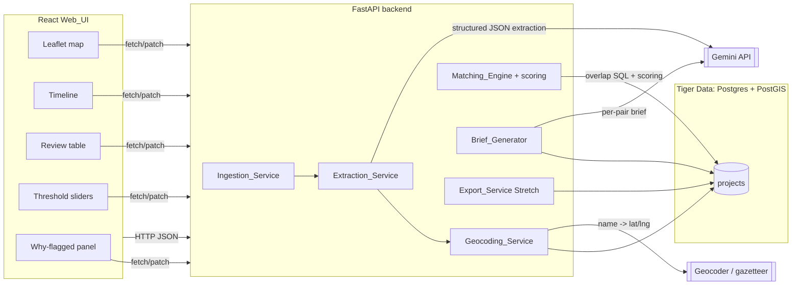
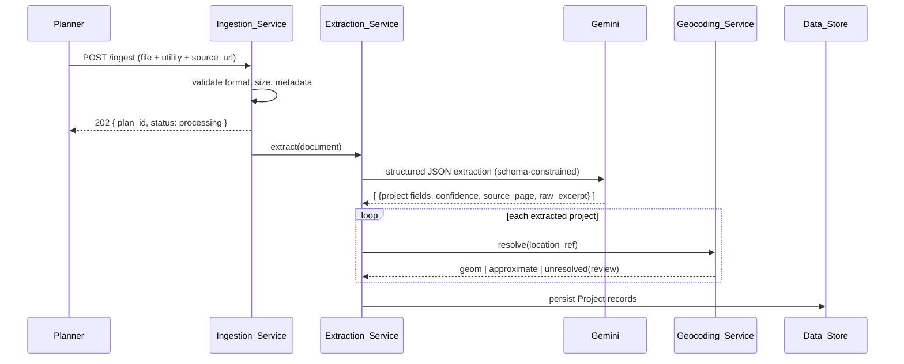
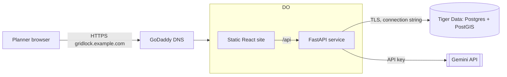

# Design Document

## Overview

GridLock is a coordination radar for electric-utility capital planners. It ingests two or more utilities' public capital plans (PDF, XLSX, CSV), uses Gemini to extract each project into a common schema, geocodes and stores each project in a PostGIS-enabled Postgres database, and flags project pairs from different utilities that are close in both space and time. Each flagged pair is scored on four factors and can be turned into a short natural-language coordination brief. The whole product is wrapped in a human-in-the-loop web UI: planners review low-confidence extractions, tune matching thresholds with live sliders, inspect why a pair was flagged, verify against the source document page, and export briefs.

This design is scoped for a 24-hour hackathon. It draws a hard line between **MVP** (must ship for the demo) and **Stretch** (ship if time allows). The MVP is a complete, demoable loop: upload → extract → review → map/timeline → tune thresholds → why-flagged → brief. Stretch adds export, 3+ utility scaling, public deployment, and true transmission-line geometry.

The design also targets several sponsor tracks, and the architecture is shaped to make each one legible in a demo:

- **Microsoft "What's Missing" (human-in-the-loop, not a chatbot):** GridLock is not a chat interface. The LLM does bounded extraction and brief drafting; a planner reviews, edits, and approves. The Review_Screen and why-flagged panel are the product, not a chat box.
- **Gemini API:** used twice, both in structured/bounded modes — structured JSON extraction (Requirement 2/3) and short constrained brief generation (Requirement 8).
- **Tiger Data (managed Postgres + PostGIS):** the Data_Store is managed Postgres with PostGIS; all spatial/temporal matching is pushed into SQL.
- **DigitalOcean App Platform + GoDaddy domain:** the Stretch deployment topology (Requirement 16).

### Requirements Traceability Summary

| Component | Requirements |
| --- | --- |
| Ingestion_Service | 1, 15.1 |
| Extraction_Service | 2, 3.1, 3.2 |
| Geocoding_Service | 4, 17 (Stretch) |
| Data_Store | 5, 13.2–13.4 |
| Matching_Engine | 6, 7, 15.2, 17.2 (Stretch) |
| Brief_Generator | 8 |
| Web_UI | 3.3, 9, 10, 11, 12, 13.1 |
| Export_Service | 14 (Stretch) |
| Deployment | 16 (Stretch) |

## Architecture

### System Diagram



### Request Flows

**Ingestion pipeline (POST /ingest), asynchronous per plan:**



**Query and tuning flow (GET /overlaps):** the Web_UI calls `GET /overlaps?radius=&pad=` whenever a slider changes; the Matching_Engine runs the overlap SQL, scores each returned pair in Python, and returns pairs with per-factor and composite scores. This is stateless — thresholds are query parameters, not stored state — so slider changes are cheap and re-runnable.

### Key Architectural Decisions

- **Push spatial/temporal matching into PostGIS SQL; do scoring in Python.** The candidate-pair filter (distance within radius, padded date-range overlap, different utilities, non-null geom) is expressed once as a parameterized SQL query. This is exact, fast, and leans on the sponsor database. Scoring is pure Python over the returned rows so it is trivially unit- and property-testable in isolation from the database.
- **Ingestion is asynchronous; POST /ingest returns an acknowledgment immediately.** Extraction + geocoding can take tens of seconds. `POST /ingest` validates synchronously (format, size, metadata) then returns `202 { plan_id }` and processes in the background. This satisfies Requirement 1.1's "acknowledgment with a unique identifier" without blocking the planner. For the hackathon, a FastAPI `BackgroundTasks` worker is sufficient; no separate queue is required for the demo dataset size.
- **Thresholds are request parameters, not persisted config.** Distance_Radius and Date_Padding arrive as query parameters on `GET /overlaps` with defaults of 25 miles / 30 days. This makes the slider-driven "watch the results change" experience (Requirement 10) a pure re-query.
- **Edits trigger an immediate re-match for the affected project.** A `PATCH /projects/{id}` that changes `geom`/`start_date`/`end_date` causes the Matching_Engine to immediately re-run overlap matching for that project and update or invalidate that project's existing Coordination_Pairs, rather than waiting for the next query (Requirement 13.4). For the hackathon this is a lightweight synchronous recompute: after persisting the edit, the affected project's pairs are recomputed in-line and stale pairs are dropped/refreshed. Because matching still reads current `geom`/`start_date`/`end_date` from the Data_Store at query time, the same edited values are also reflected in subsequent `GET /overlaps` queries.
- **Confidence and review are data, styling is UI.** The backend stores `confidence` and `reviewed`; the "requires review" visual treatment is computed in the Web_UI against the Confidence_Threshold (default 0.7). This keeps the threshold tunable in one place and avoids re-persisting derived state.

### Technology Choices

| Concern | Choice | Rationale |
| --- | --- | --- |
| Backend | Python 3.11 + FastAPI | Fast to build, native async, Pydantic DTOs, auto OpenAPI for the demo |
| DB access | SQLAlchemy Core + GeoAlchemy2, or raw `asyncpg` with parameterized SQL | Parameterized queries for the PostGIS overlap query; avoid ORM overhead for the hot path |
| Database | Tiger Data managed Postgres + PostGIS | Sponsor track; PostGIS gives `ST_DWithin`, `ST_Distance`, `daterange` overlap |
| Extraction + briefs | Gemini API (structured output mode) | Sponsor track; schema-constrained JSON for extraction, short constrained text for briefs |
| PDF/XLSX/CSV parsing | `pypdf`/`pdfplumber`, `openpyxl`, `csv` | Extract text/pages to feed Gemini; detect corrupt files |
| Geocoding | Pluggable `Geocoder` interface (hosted geocoder + local county-centroid gazetteer) | County-center fallback works offline and is deterministic for the demo |
| Frontend | React + Vite, `react-leaflet`, `vis-timeline` | Leaflet for the map, vis-timeline for the Gantt-style timeline |
| Deploy (Stretch) | DigitalOcean App Platform, GoDaddy domain | Sponsor track |

## Components and Interfaces

### Ingestion_Service (Requirements 1, 15.1)

Responsibility: accept an uploaded plan, validate it synchronously, assign a `plan_id`, and hand the document to extraction.

Interface (internal):

```python
class IngestResult(BaseModel):
    plan_id: str
    utility: str
    source_url: str
    status: Literal["processing"]

class IngestionService:
    def validate(self, upload: UploadFile, utility: str | None, source_url: str | None) -> None:
        """Raises UnsupportedFormatError, FileTooLargeError, CorruptFileError,
        or MissingMetadataError. Performs no persistence."""
    async def ingest(self, upload: UploadFile, utility: str, source_url: str) -> IngestResult:
        """Validates, records plan, schedules extraction, returns acknowledgment."""
```

Behavior:

- Detects format from content, not just the filename extension, and accepts only PDF, XLSX, CSV (1.1, 1.3). Rejection error names the *detected* format.
- Rejects files > 50 MB (1.4) and corrupt-but-supported files (1.6). On any rejection, no partial record is written (1.6, 1.7) — validation happens fully before any persistence.
- Requires `utility` and `source_url` metadata; a missing field yields an error naming the specific missing field (1.2, 1.7).
- A dataset holds 2–50 distinct utilities for MVP (1.5); Stretch relaxes the upper bound framing to "3 or more" for cross-utility matching (15.1).

### Extraction_Service (Requirements 2, 3.1, 3.2)

Responsibility: turn one accepted document into a list of Project records via Gemini structured output, assign confidence, and record provenance.

Interface (internal):

```python
class ExtractedProject(BaseModel):
    name: str = ""
    utility: str
    type: ProjectType | None = None          # substation | transmission line | generation | None
    voltage_kv: float | None = None           # 0.1 .. 2000
    location_ref: str = ""                     # substation/town/county name text
    start_date: PartialDate | None = None      # preserves quarter/year precision
    end_date: PartialDate | None = None
    confidence: float                          # 0.0 .. 1.0
    source_page: int                           # 1 .. page_count
    raw_excerpt: str                           # <= 2000 chars

class ExtractionService:
    async def extract(self, doc: ParsedDocument) -> list[ExtractedProject]:
        """Calls Gemini in structured mode. Raises ExtractionFailedError on
        model failure, in which case no Project records are created (Req 2.9)."""
```

Gemini structured extraction approach:

- **Schema-constrained call.** The Gemini request uses structured/JSON output mode with a response schema mirroring `ExtractedProject`. The schema enumerates `type` as `substation | transmission line | generation` and constrains `voltage_kv` to a number. Constraining the output shape removes free-form parsing and directly serves the "not a chatbot" story.
- **Per-project provenance.** The prompt instructs the model to emit, for every project, the `source_page` it was read from (1..page_count) and the verbatim `raw_excerpt` (truncated to 2000 chars) it was derived from (2.7, 2.8). The document is fed page-annotated so the model can attribute pages.
- **Missing values are empty, not invented.** Any field not determinable from the source is emitted as an empty value while the record is still created with the rest of its fields (2.3). If `type` cannot be classified into the enum, it is left empty and the record is retained (2.5). Voltage is only recorded when present, as kV within 0.1–2000 (2.6).
- **Confidence assignment.** Each project carries a `confidence` in 0.0–1.0 (3.1). Confidence is derived from a blend of the model's self-reported per-project certainty and a completeness heuristic (fraction of required fields the model could populate). Records default `reviewed = false` (3.2).
- **Date precision preservation.** Quarter- or year-only dates are preserved at that precision (see Data Models → `PartialDate`); the service does not infer a more specific day (4.6).
- **Whole-document failure semantics.** If the Gemini extraction call fails for the document, the service creates zero Project records and surfaces a failure to the caller identifying that extraction failed (2.9).

### Geocoding_Service (Requirements 4, 17 Stretch)

Responsibility: resolve each project's location reference to an SRID 4326 geography point, with a county-center fallback and explicit review flagging when resolution is unsafe.

Interface (internal):

```python
class GeocodeOutcome(BaseModel):
    geom: Point | None                 # None => leave geom unset
    approximate: bool = False          # True => county-center fallback
    requires_review: bool = False

class Geocoder(Protocol):
    async def resolve(self, name: str) -> list[Candidate]: ...

class GeocodingService:
    async def geocode(self, location_ref: str) -> GeocodeOutcome:
        """Applies timeout, retry, fallback, and ambiguity rules (Req 4)."""
```

Strategy:

- **Name → coordinate (primary).** A substation or town name resolves to a single lat/lng stored as an SRID 4326 geography point (4.1).
- **County-center fallback.** A county-level reference resolves to the county centroid, stored as SRID 4326 and marked `approximate = true` (4.2). The fallback uses a bundled county-centroid gazetteer so it works offline and deterministically in the demo.
- **Timeout + retry.** Each resolution attempt has a 10-second timeout; a timed-out attempt is treated as failed and retried up to 3 attempts total (4.3).
- **Unresolved → review, geom unset.** If all 3 attempts fail, the project is marked `requires_review` and `geom` is left unset (4.4).
- **Ambiguity → review, geom unset.** If a resolution returns more than one candidate, the location is treated as unresolved: `requires_review` and `geom` unset (4.5). This is deliberately conservative — a wrong pin is worse than an explicit "needs a human."
- **Stretch (17):** transmission-line projects are represented by their two endpoint substations (a `LINESTRING`/two-point geometry) and distance for line-involving pairs is measured against that geometry. MVP treats every project as a single point.

### Data_Store (Requirements 5, 13.2–13.4)

Responsibility: persist Project records and support spatial + temporal queries. See Data Models for the schema. Key points:

- `geom` is `geography(Point, 4326)` (5.2). Unset geom is `NULL`.
- `start_date`/`end_date` are stored so PostGIS `daterange` overlap works (5.3).
- `GET /projects` returns stored projects (5.4). `PATCH /projects/{id}` persists edits and returns the updated representation (13.2, 13.3); when an edit changes geom/dates, the Matching_Engine immediately re-runs overlap matching for that project and updates or invalidates that project's existing Coordination_Pairs (13.4).

### Matching_Engine + Scoring (Requirements 6, 7, 15.2, 17.2 Stretch)

Responsibility: produce scored Coordination_Pairs. Two stages: (1) a PostGIS candidate query, (2) pure-Python scoring.

**Candidate query.** Parameterized SQL (`:radius_m`, `:pad`) enforces different-utility, within-radius, padded-overlap, and non-null geom, and returns distance in miles and overlap days:

```sql
SELECT a.id AS a_id, b.id AS b_id,
       ST_Distance(a.geom, b.geom) / 1609.34 AS miles,
       upper(daterange(a.start_date, a.end_date) * daterange(b.start_date, b.end_date))
         - lower(daterange(a.start_date, a.end_date) * daterange(b.start_date, b.end_date)) AS overlap_days
FROM projects a
JOIN projects b ON a.utility < b.utility           -- different utilities, unordered, no self-pairs
WHERE a.geom IS NOT NULL AND b.geom IS NOT NULL     -- Req 6.8
  AND ST_DWithin(a.geom, b.geom, :radius_m)          -- Req 6.3
  AND daterange(a.start_date, a.end_date)
      && daterange(b.start_date - :pad, b.end_date + :pad);  -- Req 6.4
```

- The `a.utility < b.utility` join predicate simultaneously excludes self-pairs and same-utility pairs and yields each unordered pair once (6.2). Note this compares utility *identity*, so two different projects of the same utility are excluded, and a project is never paired with itself.
- `:radius_m` is Distance_Radius converted miles→meters; `:pad` is Date_Padding as a day interval. Defaults 25 mi / 30 days when parameters are absent (6.5, 6.6). Negative or non-numeric `radius`/`pad` are rejected at the API boundary with an error naming the invalid parameter (6.7).
- Distance in miles (6.9) and Overlap_Days over the padded ranges (6.10) come straight out of the query. Projects with unset geom never appear (6.8).
- Stretch 15.2: with 3+ utilities the same `a.utility < b.utility` predicate already evaluates every distinct utility combination. Stretch 17.2: line-involving distance uses line geometry via the same `ST_Distance`/`ST_DWithin` operators on the line geom.

**Scoring (pure Python over query rows).** For each returned pair the engine computes four factor scores and a composite, all in `[0,1]`, and exposes every factor plus the composite to the Web_UI (7.5, 7.7). Scoring functions are defined in Data Models / the scoring section below. Any factor whose required attribute is missing/invalid is set to `0.0` and marked indeterminate for that pair (7.6).

Interface (internal):

```python
class ScoreFactors(BaseModel):
    distance: float                 # 0..1
    overlap: float                  # 0..1
    type_similarity: float          # 0..1
    voltage_similarity: float       # 0..1
    composite: float                # 0..1
    indeterminate_factors: list[str] = []

class MatchingEngine:
    async def overlaps(self, radius_miles: float, pad_days: int) -> list[CoordinationPair]:
        ...
    def score(self, row: CandidateRow, radius_miles: float, max_overlap_days: int) -> ScoreFactors:
        ...
```

### Brief_Generator (Requirement 8)

Responsibility: produce a short coordination brief for an existing pair via Gemini.

Interface (internal):

```python
class BriefResult(BaseModel):
    pair_id: str
    text: str          # 1..4 sentences, <= 600 chars

class BriefGenerator:
    async def generate(self, pair: CoordinationPair) -> BriefResult:
        """30s budget. Raises PairNotFoundError, BriefTimeoutError,
        or BriefGenerationError; never returns a partial brief."""
```

Behavior:

- Produces the brief within 30 seconds (8.1); the Gemini call is wrapped in a 30s timeout, and a timeout returns an explicit error with no partial brief (8.6).
- Output is 1–4 sentences and ≤ 600 characters, formatted to forward to a neighboring utility (8.2). The prompt constrains length; the service also truncates/validates defensively.
- The brief states both project types, the distance in miles, and the overlapping time window (8.3), plus a proposed coordination opportunity (8.4).
- A request for a non-existent pair returns a not-found error and no brief (8.5). Any other failure for an existing pair returns an identifying error and leaves the pair unchanged (8.7).

### Web_UI (Requirements 3.3, 9, 10, 11, 12, 13.1)

React + Vite single page with these regions:

- **Leaflet map:** one marker per project at its geom (9.1); projects that belong to a Coordination_Pair are highlighted (9.3); Approximate_Location markers are visually distinguished, e.g. hollow/hatched marker (9.4).
- **Timeline (vis-timeline, Gantt-style):** each project positioned by start/end date (9.2), honoring quarter/year precision.
- **Threshold sliders:** a Distance_Radius slider and a Date_Padding slider (10.1, 10.2); moving either re-queries `GET /overlaps` and updates the displayed pairs (10.3, 10.4).
- **Review table (Review_Screen):** lists projects; those below the Confidence_Threshold (default 0.7) are visually distinguished (3.3, 13.1). Inline edit submits `PATCH /projects/{id}`.
- **Why-flagged panel:** on selecting a pair, shows the two projects side by side (11.1) with distance, Overlap_Days, and each individual score factor (11.2); if a brief exists it is shown (11.3).
- **Source-page links:** each project shows a link built from `source_url` + `source_page` (12.1) that opens the source document at that page (12.2).

### Export_Service (Requirement 14, Stretch)

`GET /export?format=csv|pdf` produces a CSV (14.1) or PDF (14.2) of Coordination_Pairs and their briefs; each record includes both utilities, both names, distance in miles, and the overlapping window (14.4). Before emitting output, the Export_Service validates that every export record has both Projects' utilities present; if any record is missing a utility, the export is rejected as invalid and no output is produced, rather than emitting a record with a missing utility (14.3). CSV via the stdlib `csv` module; PDF via a lightweight generator (e.g. `reportlab`). Deferred behind MVP.

## Data Models

### Database Schema (Data_Store)

```sql
CREATE TABLE projects (
  id serial PRIMARY KEY,
  utility text NOT NULL,
  state text,
  name text,
  type text,                       -- substation | transmission line | generation | NULL
  voltage_kv int,                  -- kV; NULL when unknown
  geom geography(Point, 4326),     -- NULL when unresolved/unset (Req 4.4, 4.5)
  start_date date,
  end_date date,
  confidence real,                 -- extraction confidence 0.0..1.0
  source_url text,
  source_page int,
  raw_excerpt text,                -- <= 2000 chars
  reviewed bool DEFAULT false,
  approximate bool DEFAULT false   -- true => county-center fallback (Req 4.2, 9.4)
);

CREATE INDEX projects_geom_gix ON projects USING GIST (geom);
CREATE INDEX projects_dates_ix ON projects (start_date, end_date);
```

Notes:

- `approximate` is added beyond the user's starter DDL to carry the Approximate_Location flag (4.2) through to the map (9.4).
- The GIST index on `geom` backs `ST_DWithin`; the date index supports range overlap scans on the demo-sized dataset.
- `voltage_kv` is stored `int` per the starter schema; the extraction DTO uses a float in 0.1–2000 and rounds to the nearest kV on persist. (A future migration to `numeric` would preserve sub-kV values; not needed for MVP.)

### PartialDate (date precision preservation, Req 4.6)

The source often gives only a quarter or a year. To avoid inventing precision, extraction carries a `PartialDate { year, quarter?, month?, day? }`. On persist, `start_date`/`end_date` are materialized to the range the precision implies — e.g. "Q2 2026" → start_date `2026-04-01`, end_date `2026-06-30` — and the original precision is retained in the raw record and used by the timeline for labeling. Matching operates on the materialized `date` bounds so PostGIS `daterange` works unchanged.

### API DTOs

```python
class ProjectDTO(BaseModel):
    id: int
    utility: str
    state: str | None
    name: str | None
    type: ProjectType | None
    voltage_kv: int | None
    lat: float | None                 # from geom; null when unset
    lng: float | None
    start_date: date | None
    end_date: date | None
    confidence: float
    source_url: str | None
    source_page: int | None
    raw_excerpt: str | None
    reviewed: bool
    approximate: bool

class ScoreFactorsDTO(BaseModel):
    distance: float
    overlap: float
    type_similarity: float
    voltage_similarity: float
    composite: float
    indeterminate_factors: list[str]

class CoordinationPairDTO(BaseModel):
    id: str                           # stable pair id, e.g. f"{a_id}-{b_id}" with a_id<b_id
    project_a: ProjectDTO
    project_b: ProjectDTO
    miles: float
    overlap_days: int
    scores: ScoreFactorsDTO

class CoordinationBriefDTO(BaseModel):
    pair_id: str
    text: str
    generated_at: datetime
```

### Endpoint Summary

| Method | Path | Purpose | Requirements |
| --- | --- | --- | --- |
| POST | `/ingest` | Upload a plan (multipart: file + utility + source_url) | 1, 15.1 |
| GET | `/projects` | List stored projects | 5.4, 9, 13.1 |
| PATCH | `/projects/{id}` | Review/edit a project | 13.2–13.6 |
| GET | `/overlaps?radius=&pad=` | Scored coordination pairs | 6, 7, 10 |
| POST | `/overlaps/{id}/brief` | Generate a brief for a pair | 8 |
| GET | `/export?format=csv\|pdf` | Export briefs (Stretch) | 14.1, 14.2, 14.3, 14.4 |

### Scoring Functions

All factors are pure functions returning a value in `[0,1]`. Let `radius` be the effective Distance_Radius (miles) and `max_overlap` the configured maximum overlap-days threshold.

- **Distance score** (7.1): monotonically decreasing from 1.0 at 0 miles to 0.0 at/beyond `radius`.
  `distance_score(miles) = clamp(1 - miles / radius, 0, 1)`.
- **Overlap score** (7.2): 0.0 when `overlap_days <= 0`, rising monotonically to 1.0 at/beyond `max_overlap`.
  `overlap_score(days) = clamp(days / max_overlap, 0, 1)` with `days <= 0 → 0`.
- **Type-similarity score** (7.3): `1.0` if both types equal (and present), else `0.0`.
- **Voltage-similarity score** (7.4): `1.0` when equal; otherwise decreasing monotonically in the absolute difference.
  `voltage_score(v_a, v_b) = clamp(1 - |v_a - v_b| / V_SCALE, 0, 1)` for a fixed `V_SCALE` (e.g. 500 kV).
- **Composite score** (7.5): a fixed convex combination of the four factors with non-negative weights summing to 1, e.g. `w_dist=0.4, w_overlap=0.3, w_type=0.15, w_volt=0.15`. Because each factor is in `[0,1]` and the weights form a convex combination, the composite is guaranteed to lie in `[0,1]`.
- **Indeterminate factors** (7.6): if an input required for a factor is missing/invalid (e.g. a `NULL` voltage or type), that factor is set to `0.0` and its name added to `indeterminate_factors`; the composite still combines the four (now-zeroed) factors.

## Error Handling

Errors return a consistent JSON shape `{ "error": { "code": str, "message": str, "field"?: str, "detected_format"?: str } }` with an appropriate HTTP status. No endpoint leaves partial state on a rejected request.

| Endpoint | Condition | Status | Behavior | Req |
| --- | --- | --- | --- | --- |
| POST /ingest | Unsupported format | 415 | Error names the detected format; no record retained | 1.3 |
| POST /ingest | File > 50 MB | 413 | Error states 50 MB limit; no record | 1.4 |
| POST /ingest | Corrupt but supported | 422 | Error "could not be read"; no partial record | 1.6 |
| POST /ingest | Missing utility or source_url | 422 | Error names the missing field; no record | 1.2, 1.7 |
| (async) extraction | Gemini extraction fails | — | Zero Project records; plan status = failed | 2.9 |
| GET /overlaps | radius/pad negative or non-numeric | 422 | Error names the invalid parameter | 6.7 |
| POST /overlaps/{id}/brief | Pair does not exist | 404 | Not-found error; no brief | 8.5 |
| POST /overlaps/{id}/brief | Gemini timeout (>30s) | 504 | Timeout error; no partial brief | 8.6 |
| POST /overlaps/{id}/brief | Other failure, existing pair | 502 | Identifying error; pair unchanged | 8.7 |
| PATCH /projects/{id} | Invalid field value(s) | 422 | Names invalid fields; no changes persisted | 13.5 |
| PATCH /projects/{id} | Project id not found | 404 | Not-found error; no changes | 13.6 |

Geocoding failures are not endpoint errors — they degrade gracefully by marking the project `requires_review` with unset geom (4.4, 4.5), keeping the ingestion pipeline flowing.

## Human Review Workflow and Edit Feedback

The human-in-the-loop loop is the heart of the "What's Missing" story:

1. **Surface uncertainty.** Extraction assigns `confidence` and sets `reviewed = false`; geocoding sets `requires_review` for unresolved/ambiguous locations. The Review_Screen visually distinguishes projects below the Confidence_Threshold (default 0.7) (3.3, 13.1).
2. **Edit.** A planner corrects fields — including `geom` (drag a pin / enter coordinates) and `start_date`/`end_date` — via `PATCH /projects/{id}`. Valid edits are persisted and the updated Project is returned within 2 seconds (13.2); setting `reviewed = true` persists that flag (13.3). Invalid values are rejected with per-field errors and nothing is persisted (13.5); unknown ids return 404 (13.6).
3. **Feed back into matching immediately.** When an edit changes `geom`/dates, the Matching_Engine immediately re-runs overlap matching for that project and updates or invalidates that project's existing Coordination_Pairs — pairs that no longer qualify are dropped and still-qualifying pairs are recomputed against the post-edit values (13.4). Because matching also reads live `geom`/dates at query time, the edited value likewise governs all subsequent overlap matching for that project.
4. **Re-tune and re-inspect.** The planner moves the sliders (10) to re-run matching, opens the why-flagged panel (11) to inspect the score breakdown side by side, follows the source-page link to verify against the original plan (12), and generates a brief (8) once satisfied.

## Correctness Properties

*A property is a characteristic or behavior that should hold true across all valid executions of a system — essentially, a formal statement about what the system should do. Properties serve as the bridge between human-readable specifications and machine-verifiable correctness guarantees.*

The properties below are the outcome of a per-acceptance-criterion analysis followed by a redundancy pass. They concentrate on GridLock's own computable logic — matching set membership, the four scoring functions and the composite, geocoding outcome rules, extraction-record schema invariants, date-precision preservation, persistence/edit round-trips, and ingestion validation. Criteria that depend on the external LLM's output quality, on external service behavior, or on UI rendering are covered by the golden-set, integration, and snapshot tests described in the Testing Strategy, not by property tests.

### Property 1: Valid pair membership

*For any* set of stored projects and any non-negative `radius` and `pad`, every Coordination_Pair returned by matching satisfies all of: the two projects have different utilities; the two projects have different ids (no self-pair); both projects have a non-null geom; their distance in miles is ≤ `radius`; and their date ranges, each extended by `pad`, overlap. Equivalently, no returned pair violates any inclusion criterion.

**Validates: Requirements 6.2, 6.3, 6.4, 6.8, 6.10**

### Property 2: Matching symmetry and well-formed distance

*For any* set of stored projects and thresholds, the set of flagged pairs is invariant under swapping the two projects of a pair, and each pair's computed `miles` (≥ 0) and `overlap_days` are order-independent. Pair `{a,b}` is flagged if and only if `{b,a}` would be.

**Validates: Requirements 6.1, 6.2, 6.9**

### Property 3: Distance score is bounded and monotonically non-increasing

*For any* distance `d ≥ 0` and effective `radius > 0`, `distance_score(d)` lies in `[0,1]`, equals `1.0` when `d = 0`, equals `0.0` when `d ≥ radius`, and for any `d1 ≤ d2`, `distance_score(d1) ≥ distance_score(d2)`.

**Validates: Requirements 7.1**

### Property 4: Overlap score is bounded and monotonically non-decreasing

*For any* `overlap_days` value and configured `max_overlap > 0`, `overlap_score` lies in `[0,1]`, equals `0.0` when `overlap_days ≤ 0`, equals `1.0` when `overlap_days ≥ max_overlap`, and for any `d1 ≤ d2`, `overlap_score(d1) ≤ overlap_score(d2)`.

**Validates: Requirements 7.2**

### Property 5: Type-similarity is exact and symmetric

*For any* two present project types, `type_similarity` equals `1.0` when the types are equal and `0.0` when they differ, and the result is unchanged when the two types are swapped.

**Validates: Requirements 7.3**

### Property 6: Voltage-similarity is bounded, monotone in difference, and symmetric

*For any* two voltages `v_a` and `v_b`, `voltage_similarity` lies in `[0,1]`, equals `1.0` when `v_a = v_b`, is symmetric under swapping the two voltages, and does not increase as the absolute difference `|v_a − v_b|` increases.

**Validates: Requirements 7.4**

### Property 7: Composite score is bounded and factor-monotone

*For any* four factor values each in `[0,1]`, the composite score lies in `[0,1]`, and increasing any single factor while holding the others fixed does not decrease the composite (it is a convex combination with non-negative weights summing to 1).

**Validates: Requirements 7.5**

### Property 8: Missing factor inputs are zeroed and flagged indeterminate

*For any* Coordination_Pair in which an attribute required to compute a given factor is missing or invalid, that factor's score is exactly `0.0` and the factor's name appears in the pair's `indeterminate_factors`; unaffected factors are computed normally.

**Validates: Requirements 7.6**

### Property 9: Geocoding resolution outcome

*For any* sequence of resolution attempt outcomes and candidate counts: the service makes at most 3 attempts; if all attempts fail or time out, the outcome marks the project as requiring review with geom unset; if any attempt returns exactly one candidate, geom is set to that point; if any resolving attempt returns more than one candidate, the location is treated as unresolved with the project marked requiring review and geom unset.

**Validates: Requirements 4.3, 4.4, 4.5**

### Property 10: Date precision is preserved, never refined

*For any* source date supplied at year, quarter, month, or day precision, the preserved precision equals the input precision (never finer), and the materialized `[start_date, end_date]` range equals the canonical calendar span implied by that precision.

**Validates: Requirements 4.6**

### Property 11: Accepted extracted record satisfies schema invariants

*For any* extraction record the service accepts, `confidence` lies in `[0,1]`, `source_page` is an integer in `[1, page_count]`, `raw_excerpt` is at most 2000 characters, `type` is either one of the enumerated values or empty, and `voltage_kv` is either within `[0.1, 2000]` kV or empty.

**Validates: Requirements 2.4, 2.6, 2.7, 2.8, 3.1**

### Property 12: Undeterminable fields are emptied, record still created

*For any* model output with an arbitrary subset of fields undeterminable, the produced Project record is still created, every determinable field retains its value, and every undeterminable field (including an unclassifiable `type`) is set to empty.

**Validates: Requirements 2.3, 2.5**

### Property 13: Persistence round-trip

*For any* valid Project, persisting it to the Data_Store and reading it back yields equal field values, with the geom preserved as an SRID 4326 geography point.

**Validates: Requirements 5.1, 5.2, 5.3**

### Property 14: Edit round-trip and effect on matching

*For any* valid edit to an existing Project's fields, reading the Project back after the edit reflects the edited values; and when the edit changes geom or a date field, the immediate re-match for that project yields Coordination_Pairs consistent with the post-edit values — every retained pair satisfies the inclusion criteria under the edited values, and any pre-edit pair that no longer qualifies is invalidated (removed) while still-qualifying pairs are updated to match the post-edit values.

**Validates: Requirements 13.2, 13.4**

### Property 15: Invalid edits are rejected and leave the target unchanged

*For any* PATCH request containing one or more invalid field values, the request is rejected with an error naming the invalid field(s), and reading the target Project back yields exactly its pre-edit state (no field persisted).

**Validates: Requirements 13.5**

### Property 16: Ingestion accept/reject invariant

*For any* submission, it is accepted if and only if its detected format is one of PDF/XLSX/CSV, its size is ≤ 50 MB, and both `utility` and `source_url` metadata are present; every rejected submission leaves no persisted record and returns an error identifying the reason (the unsupported detected format, the size limit, or the missing metadata field).

**Validates: Requirements 1.2, 1.3, 1.4, 1.7**

### Property 17: Review predicate matches the threshold boundary

*For any* `confidence` value and `Confidence_Threshold`, a Project is marked as requiring review if and only if `confidence < threshold`.

**Validates: Requirements 3.3, 13.1**

### Property 18: Source link encodes the page

*For any* `source_url` and `source_page`, the constructed source link is derived from `source_url` and encodes the given `source_page`, so activating it targets that page.

**Validates: Requirements 12.1**

## Testing Strategy


GridLock's testing is deliberately layered because the system mixes three kinds of code: **pure logic we fully control** (matching membership, scoring, geocoding decision rules, date-precision, validation), **external non-deterministic services** (Gemini extraction and brief generation, the hosted geocoder), and **UI rendering**. Each layer gets the test type that actually catches its bugs.

### Property-Based Testing (pure logic)

Property-based testing is the primary tool for the scoring functions, matching set membership, geocoding decision rules, extraction-record invariants, date-precision handling, and validation — everything expressible as "for all inputs X, property P(X) holds."

- **Library:** [Hypothesis](https://hypothesis.readthedocs.io/) for the Python backend; `fast-check` for any pure TS helpers on the frontend (e.g. the source-link builder, the review predicate).
- **Iterations:** each property test runs a minimum of 100 generated cases.
- **Traceability tag:** each property test carries a comment of the form
  `# Feature: gridlock, Property {number}: {property_text}` referencing the design property it implements.
- **One test per property:** each of Properties 1–18 is implemented by a single property-based test.
- **Generators:** custom Hypothesis strategies produce project sets (varied utility, geom presence/coordinates, date ranges at mixed precision, types, voltages), threshold pairs (non-negative `radius`/`pad`, plus invalid negatives/non-numerics for Property 16-adjacent validation), factor tuples in `[0,1]`, geocoder attempt-outcome sequences, and candidate-count lists.
- **Isolation via mocks:** properties over geocoding (P9) mock the `Geocoder` and clock so timeout/retry/ambiguity branches are exercised deterministically and cheaply; properties over extraction invariants (P11, P12) feed generated *model-output* records into the normalizer rather than calling Gemini. This keeps 100+ iterations fast and free of external cost.
- **DB-backed properties:** the persistence and edit round-trips (P13, P14) and matching-membership/symmetry properties (P1, P2) run against a disposable Postgres+PostGIS test database (a Docker container or a scratch Tiger Data schema) so `ST_DWithin`/`ST_Distance`/`daterange` behavior is the real thing, not a re-implementation.

Property-to-requirement coverage: Properties 1–2 cover matching (Req 6); Properties 3–8 cover scoring (Req 7); Property 9 covers geocoding outcomes (Req 4.3–4.5); Property 10 covers date precision (Req 4.6); Properties 11–12 cover extraction invariants (Req 2, 3.1); Property 13 covers storage (Req 5); Properties 14–15 cover the edit workflow (Req 13); Property 16 covers ingestion validation (Req 1); Property 17 covers the review predicate (Req 3.3, 13.1); Property 18 covers source linking (Req 12.1).

### Golden Set (extraction accuracy — what PBT cannot verify)

Extraction correctness depends on Gemini's output and cannot be a universal property. To measure it, maintain a **hand-checked golden set**: a small corpus of real/representative utility plan pages (a few PDFs, an XLSX, a CSV) with a human-authored expected set of Project records (name, utility, type, voltage_kv, location_ref, dates, source_page). A harness runs extraction over the corpus and reports precision/recall on projects and per-field accuracy against the golden labels, plus how often `source_page`/`raw_excerpt` point to the right place. This is the number to quote in the demo ("N of M projects extracted correctly") and the regression guard when the prompt or schema changes. It is an example/accuracy suite, not a pass/fail unit gate — a threshold (e.g. ≥ 80% field accuracy) can gate CI.

### Integration Tests (external services and endpoints)

- **Gemini brief generation (Req 8):** integration tests with the timeout wrapper — assert a brief is produced within 30s for a real pair (1–2 examples), that the assembled prompt context contains the injected facts (both types, miles, overlapping window) per 8.3, and that timeout/failure/nonexistent-pair paths return the right errors with no partial brief (8.5–8.7) using a mocked slow/failing client.
- **Extraction failure (Req 2.9):** mock Gemini to raise; assert zero persisted records and a surfaced failure.
- **Endpoint contract tests:** FastAPI `TestClient` exercises each endpoint for happy path and the error table above — `POST /ingest` accept/reject and no-partial-record (corrupt file, oversize, bad format, missing metadata), `GET /projects`, `PATCH /projects/{id}` valid/invalid/not-found and the 2-second latency budget (13.2), `GET /overlaps` defaults and invalid-parameter rejection (6.5–6.7), `POST /overlaps/{id}/brief` errors.
- **Geocoding examples (Req 4.1, 4.2):** mocked single-candidate resolve → 4326 point, `approximate=false`; county reference → county centroid with `approximate=true`.

### Unit / Example Tests

Targeted examples for edge and boundary cases that don't warrant 100 iterations: corrupt files per supported format (1.6), the 2/50/51-utility boundaries (1.5), `reviewed=false` on creation (3.2), config defaults (6.5, 6.6), `PATCH reviewed=true` (13.3), and not-found ids (8.5, 13.6).

### UI Tests

React component and interaction tests (React Testing Library, plus snapshot/visual checks): map markers at geom with paired highlighting and approximate-marker styling (9.1–9.4), timeline positioning (9.2), slider-driven re-query with the new `radius`/`pad` params (10.1–10.4), the why-flagged side-by-side panel with factor breakdown and brief display (11.1–11.3), the review table's below-threshold styling (3.3, 13.1), and source-link activation (12.2). These verify rendering and wiring; the pure predicates behind them (review threshold, link construction) are additionally covered by Properties 17 and 18.

### Stretch Testing

Export (Req 14): a property for CSV record completeness (every exported row contains both utilities, both names, miles, and the overlapping window) plus an example/snapshot for PDF. Cross-utility coverage (15.2): a property that with 3+ utilities every distinct utility combination is considered. Deployment (16): a smoke test that the public domain responds. Transmission-line geometry (17): example tests that line-involving distance uses the line geometry.

## Deployment Topology (Stretch — Requirement 16)

MVP runs locally: FastAPI (`uvicorn`), the Vite dev server, and a Postgres+PostGIS instance (local Docker or a Tiger Data dev database). The Stretch deployment makes GridLock publicly reachable:



- **DigitalOcean App Platform (16.1):** two components in one app — a static-site component for the built React bundle and a service component for the FastAPI backend. The frontend calls the backend under a `/api` route (or a separate subdomain) so both sit behind one app.
- **Tiger Data (managed Postgres + PostGIS):** the backend connects over TLS using a connection string held in an App Platform environment variable/secret; PostGIS is enabled on the managed database. No database runs inside the app component.
- **Gemini:** the API key is an App Platform secret, read by the backend only; it is never exposed to the browser.
- **GoDaddy domain (16.2):** the registered domain's DNS points at the App Platform app (CNAME/A record per DigitalOcean's custom-domain setup), and App Platform provisions TLS so the Web_UI is reachable at the public domain over HTTPS.
- **Config & secrets:** database URL and Gemini key are injected as environment secrets; nothing sensitive is baked into the frontend bundle. This keeps the "not a chatbot / human-in-the-loop" backend surface the only thing holding credentials.

This topology is intentionally deferred behind the MVP loop: it earns the DigitalOcean and Tiger Data sponsor tracks and lets the team demo from a public URL, but none of it is required for the core upload → extract → review → match → brief demo to work locally.
